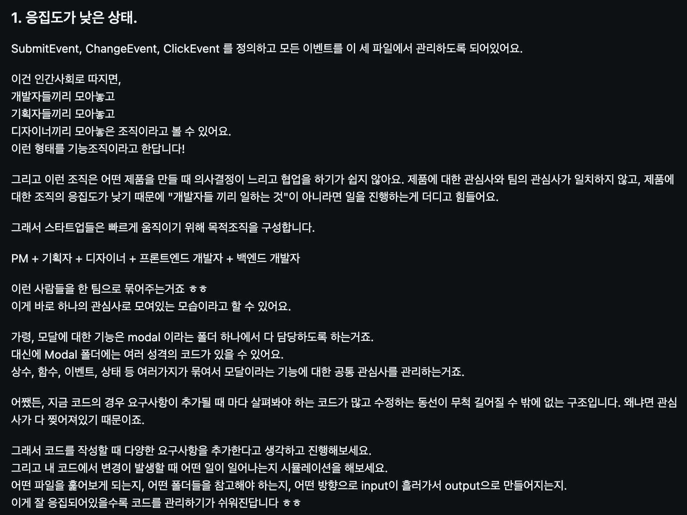

# 1. 기술 회고 ✏️

자동차 경주, 로또 미션에서는 객체와 class, 도메인과 UI의 관심사 분리 등에 대해 깊게 고민해볼 수 있었다. 그리고 점심 뭐 먹지, 영화 리뷰 미션에서는 컴포넌트와 함수, API 요청 및 비동기와 이벤트 루프에 대해 공부해볼 수 있었다.

매주 미션을 진행하며 리뷰어에게 리뷰를 받고 크루들과 소통하며 너무 많은 것들을 배웠기에 이 회고에 학습한 모든 것을 정리할 순 없겠지만,

기억에 남는 핵심적인 학습을 키워드 중심으로 짧게 돌아보고자 한다.

## 1.1. 객체와 class

### 1.1.1. class의 오남용

프리코스 때부터 별 고민 없이 관습적으로 써왔던 `class`의 사용에 대해 다시 돌아보게 되었다.

`객체 !== class` 이며, `class !== 객체지향 프로그래밍` 이다. 자바스크립트는 본래 프로토타입 기반의 언어이고 class 문법 또한 프로토타입 체인 상속을 추상화한 것에 지나지 않기 때문에, class를 사용하지 않고도 충분히 객체지향 프로그래밍이 가능하다.
무분별한 class 사용은 의미없이 가독성 떨어지고 비효율적인 코드를 만들 수 있다.

이러한 개념에 대해서 리뷰어와 소통하고 개인적으로 학습하면서, 기존의 내 코드는 별 고민없이 프리코스 때 남들이 그렇게 썼으니까, class를 남발하며 작성하였음을 알게되었다. 그리고 앞으로 개발할 때 어떤 상황에서 class를 써야하는지에 대해 나만의 기준을 세우게 되었다.

- 복잡한 상태를 가지는지?
- 인스턴스 만들어 여기저기 재사용을 해야하는지?
- 상속/조합 이 필요한 상황인지?

그리고 간단한 상태만 필요하다면 `클로저 함수`로도 충분히 작성할 수 있다는 것을 알게되어, 미션이 진행될 수록 `class`의 사용 빈도가 현저히 낮아지게 되었다.

### 1.1.2. class의 상속과 조합

class의 상속과 조합 활용에 대해서도 학습하게 되었다. 상속은 코드 재사용 측면에서 강력한 문법이지만, 잘못 사용하면 오히려 코드의 유연성을 떨어뜨릴 수 있다는 점을 배웠다. 상속보다 조합(Composition)이 더 적합한 경우도 많다는 것을 느꼈고, 로또 2단계 리팩토링에서 조합의 개념을 적용해보았다.

### 1.1.3. 모델의 역할과 중간 계층 객체

기존의 나의 코드에서는 모델을 마치 상태를 가진 데이터 저장소처럼 작성하고 사용하였다.
하지만 모델은 자신의 역할을 책임지고 메세지를 던지는 주체여야한다고 생각하게 되었다.

또한 이렇게 작성하니 이전보다는 컨트롤러의 과중한 부담이 덜어지긴 했지만, 그럼에도 컨트롤러가 여전히 지닌 책임이 너무 많다는 생각이 들었다.

그래서 컨트롤러와 모델의 역할에 대해 계속 고민하고 여러 피드백들을 보면서 중간 레이어 객체를 만들게 되었다.

모델들의 의존성 주입을 받아 컨트롤러와 소통하는 모델이며 이를 구현하기 위해 배웠던 조합(Composition)을 적용해보았다.

## 1.2. 컴포넌트

### 1.2.1. 컴포넌트를 나누는 기준

컴포넌트를 나누는 나만의 기준이 생겼다. 기존에는 단순히 반복되는 UI인지만으로 나누었으나, 이제 반복되는 기능이나 폼도 고려하여 조립된 컴포넌트도 만들게 되었다. 그래도 결국 중복을 모듈화한다는 큰 기준은 바뀌지 않은 것 같다.

### 1.2.2. 컴포넌트의 관심사 - 기능 조직 v.s. 목적 조직 (+응집도)

기능 조직과 목적 조직. 점심 뭐 먹지 리뷰어 해먼드에게 처음 들었던 생소한 개념이다.

컴포넌트 고민을 시작했던 점심 뭐 먹지 미션에서는 리뷰어 덕분에 정말 생소하고 낯선 관점에서부터 코드를 고민해볼 수 있었다.

## 1.3 비동기, 웹 API와 이벤트 루프

### 1.3.1. 비동기

프리코스 때 readLineAsync()를 사용해야한다는 조건 때문에 처음 보았던 비동기에 대해 공부하게 되었다. 비동기를 사용하는 방법은 `콜백 함수`, `Promise`, `async/await` 이 있다는 것을 알았고 각 문법이 등장한 배경도 배웠다. 콜백 지옥을 해결하기 위해 등장한 Promise, 가독성과 유지보수성을 위해 등장한 async await 등…

### 1.3.2. 웹 API와 이벤트 루프

싱글 스레드인 자바스크립트가 마치 멀티스레드인 것처럼 비동기 작업을 수행할 수 있는 동작 원리에 대해서도 학습할 수 있었다. 브라우저의 멀티 스레드를 빌리며, 웹의 이벤트 루프가 비동기 작업을 처리해준다는 것을 알았는데, 수업 중에 그렸던 `콜스택 - 이벤트 루프 - 마이크로 태스크큐 - 매크로 태스크큐` 그림이 이해에 도움이 되었다.

번외로 이 개념을 학습하면서, 언젠가 블로그에 대충 개념만 적었던 TDZ와 호이스팅, this바인딩에 대해서도 학습하게 되었다.

---

하지만 사실 비동기에 대한 학습은 아직 부채로 남아있다. 미션을 구현하기에 급급해서 깊게 따로 찾아보고 공부해보진 못하고 대충 이런 키워드들이 있구나 수준으로 학습한 느낌이라 방학 동안 열심히 복습하고 공부해야겠다.

# 2. 감정 회고 💭

## 2.1. 유강스 워크숍을 하며 가장 의미있었던 순간

일단 어떻게든 혼자 해결하며 남에게 물어보기는 절벽 끝에 매달려 외치는 최후의 SOS였던 프리랜서의 오랜 습관이 고쳐졌다. 이건 사실 프리랜서여서라기보다 이런 성향 때문에 프리랜서를 택한 것도 크기 때문에 정말 나의 오랜 성향에 변화가 생긴 셈이다.

구체적으로 말하자면 지금은 모르는 게 생기면 크루들에게도 바로바로 물어보고 고민도 해보고 리뷰어와도 활발한 소통을 하는 모습으로 바뀌었다.
다른 사람의 시간을 쓸데없이 뺏는 것 같아서, 모르는 것을 물어보기 머쓱해서 등등의 이유로 눈치를 보며 혼자 끙끙댔던 과거와 비교해보면, 지금의 습관이 훨씬 긍정적인 것 같다.

더 짧은 시간 내에 빨리 해결하고 많이 배우며 성장할 수 있었기 때문이다.

### 2.2. 의미있는 경험을 할 수 있었던 이유

크루들이 있었기 때문이다! 개발을 시작한지 얼마 되지 않아 헛소리도 많이하고 아주 기초적인 질문들도 자주 하였는데 단 한 명도, 단 한 번도 짜증내거나 무시한 사람은 없었다.
모두가 친절하게 자신의 고민처럼 깊게 생각하고 알려주었고 덕분에 기죽지 않고 모르는 건 공부하면 된다는 마인드를 가질 수 있었다.

### 2.3 유연성 강화를 위해 시도했던 것

쭈뼛쭈뼛 크루들에게 모르는 걸 물어보러가던 그 때 기분이 생각난다. 그거 사실 엄청난 용기였어...

하지만 지금은 모두가 나의 gpt ㅋ 감사합니다 크루들...나도 얼른 도움줄 수 있는 크루원이 되어야겠다.

그리고 첫주차에는 리뷰어와 소통도 제대로 하지 않았었는데
지금은 저번 미션도, 이번 미션도 1단계 피드백에서 코멘트 70개가 넘어가는 매우 큰 변화가 생겼다.

코딩이라는 게 이렇게 코드리뷰를 활발하게 주고받을 때 많이 배우고 성장할 수 있는 것 같아서, 개발자들의 활발한 커뮤니티가 이해되었다.
